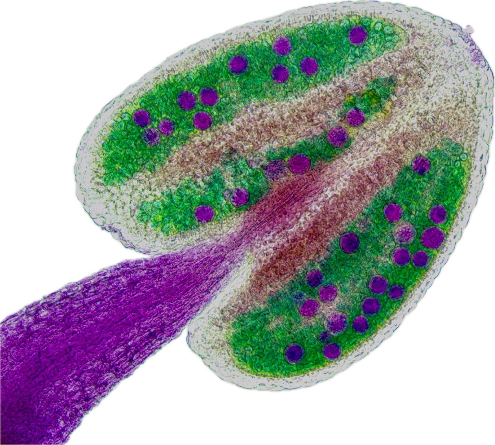
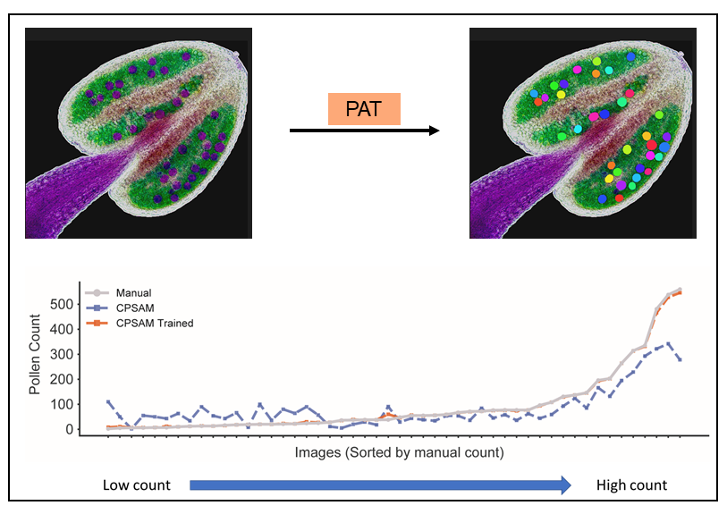

<p align="center">
  
</p>

<h1 align="center">🌸 Pollen Analysis Tool (PAT)</h1>

<p align="center">
  <b>AI-powered pollen segmentation and viability analysis — no coding required</b><br>
  Built for biologists, powered by <a href="https://github.com/MouseLand/cellpose">Cellpose-SAM</a>
</p>

<p align="center">
  <a href="https://github.com/Riha-Lab/Pollen-Analysis-Tool/actions/workflows/build-release.yml">
    
  </a>
  <a href="https://hub.docker.com/r/vivekraxwal/pollen-analysis">
    
  </a>
  <a href="https://github.com/Riha-Lab/Pollen-Analysis-Tool/releases/latest">
    
  </a>
  <a href="LICENSE">
    
  </a>
</p>

---

## What is PAT?

**Pollen Analysis Tool (PAT)** is a desktop application that automates the detection, segmentation, and counting of viable pollen grains in Alexander stained microscopy images. It uses state-of-the-art deep learning (Cellpose-SAM or fine-tuned Cellpose-SAM) to accurately count  pollen grains, and generate publication-ready statistical reports — all through a simple point-and-click interface.

No programming experience is needed. PAT runs on Windows and macOS, or via Docker on any platform.

<p align="center">
  
  <br>
  <em>PAT automatically detects and colour-codes individual pollen grains from confocal microscopy images</em>
</p>

---

## 🖥️ Features

**Segmentation & Detection**
- Automatic pollen grain segmentation using Cellpose-SAM, or a custom fine-tuned model (cellpose_pollen)
- Interactive manual correction — add, remove, or edit detections with a click
- Batch processing of entire image folders

**Model Training**
- Built-in annotation interface — label your own images
- Fine-tune a custom Cellpose model on your specific pollen morphology
- Load and share custom model weights

**Statistics & Reporting**
- Comparison across multiple samples and treatments
- Automatic selection of appropriate statistical test (ANOVA or Kruskal-Wallis) with post-hoc analysis
- Exports: CSV data table · boxplot figure · full PDF report

---

## 📁 Output files

For each analysis run PAT saves:

| File | Description |
|------|-------------|
| `*_mask.png` | 16-bit mask with each grain labelled by unique ID |
| `*_overlay.png` | Colour-coded segmentation overlaid on original image |
| `*_counts.csv` | Per-grain area |
| `results_boxplot.png` | Publication-ready comparison figure |
| `pollen_report.pdf` | Full statistical report with all figures |

---

## 📥 Installation — choose your method

### Option A — Native desktop app

| Platform | Download |
|----------|----------|
| 🪟 **Windows** 10/11 (Intel or AMD) | [`PollenAnalysisTool-Setup-Windows-x64.exe`](https://github.com/Riha-Lab/Pollen-Analysis-Tool/releases/latest) |
| 🍎 **macOS** Apple Silicon (M1 / M2 / M3) | [`PollenAnalysisTool-macOS-arm64.dmg`](https://github.com/Riha-Lab/Pollen-Analysis-Tool/releases/latest) |
| 🍎 **macOS** (Intel) | Use Docker or run from source — see below |

**Windows — step by step** (CPU only)
1. Download `PollenAnalysisTool-Setup-Windows-x64.exe` from the link above.
2. Double-click the installer → click **Next** → **Install**.
3. A shortcut appears on your desktop. Launch it and you're done.

> ⚠️ Windows may show a SmartScreen warning for unsigned software. Click **More info → Run anyway**.


** Windows (GPU usage)** 
1) Download the repository (see option B windows)
2) double click setup-conda.bat file This will install dependencies
3) double click launch-pollen.bat to start the tool

**macOS — step by step**
1. Download the `.dmg` for Mac (Apple Silicon).
2. Double-click the `.dmg` → drag **PollenAnalysisTool** into **Applications**.
3. First launch: right-click the app → **Open** → **Open** (bypasses Gatekeeper).

> ⚠️ macOS may also block running the app.
1.  Open System Settings (formerly System Preferences).
2.  Navigate to Privacy & Security.
3.  Scroll down to the Security section.
4.  You will see a message saying: "PAT was blocked from use because it is not from an identified developer."
5.  Click Open Anyway

---
### Option B — Conda (recommended for developers & GPU users)

Works on Windows, Linux, and macOS. GPU is used automatically if an
NVIDIA card is present — no manual CUDA installation needed.

**Linux / macOS**
```bash
git clone https://github.com/Riha-Lab/Pollen-Analysis-Tool.git
cd Pollen-Analysis-Tool
bash setup-conda.sh          # installs conda if needed, auto-detects GPU
conda activate pollen-analysis
python pollen_analysis_app.py
# or just: bash launch-pollen.sh
```

**Windows** — open any terminal (CMD, PowerShell, or Anaconda Prompt):
```bat
git clone https://github.com/Riha-Lab/Pollen-Analysis-Tool.git
cd Pollen-Analysis-Tool
setup-conda.bat
:: then double-click launch-pollen.bat to start the tool
```
### Option C — Docker (Linux, macOS, Windows · CPU or GPU)

Docker lets you run the tool in an isolated container with a single command.
No Python installation needed.

#### Prerequisites
- [Docker Desktop](https://www.docker.com/products/docker-desktop/) (Windows / macOS) or Docker Engine (Linux)
- An X11 server to display the GUI:
  - **Linux** — already included
  - **macOS** — install [XQuartz](https://www.xquartz.org/) and enable *"Allow connections from network clients"* in Preferences → Security
  - **Windows** — install [VcXsrv](https://vcxsrv.sourceforge.io/) (check *Disable access control* when launching)

#### Start the app

```bash
# 1. Clone the repository (or just download docker-compose.yml)
git clone https://github.com/Riha-Lab/Pollen-Analysis-Tool.git
cd Pollen-Analysis-Tool

# 2. (macOS / Linux) Allow Docker to connect to your display
xhost +local:docker

# 3. Launch
docker compose up
```

The first run downloads the container image (~3 GB) and the Cellpose-SAM model weights.
Subsequent runs start in seconds.

**Your data** — place image files in `~/PollenData/` on your computer.
That folder is automatically mounted inside the container as `/data/`.

#### GPU acceleration (NVIDIA only)

```bash
docker compose --profile gpu up
```

Requires the [NVIDIA Container Toolkit](https://docs.nvidia.com/datacenter/cloud-native/container-toolkit/install-guide.html).

#### Useful Docker commands

```bash
# Run in background
docker compose up -d

# Stop the container
docker compose down

# Update to the latest version
docker compose pull && docker compose up

# Remove downloaded weights cache
docker volume rm pollen-analysis-tool_pollen_weights
```

---

### Option D — Run from source (developers / advanced users)

```bash
# Requires Python 3.10 or 3.11
git clone https://github.com/Riha-Lab/Pollen-Analysis-Tool.git
cd Pollen-Analysis-Tool

python -m venv .venv
# Windows:
.venv\Scripts\activate
# macOS / Linux:
source .venv/bin/activate

pip install torch torchvision --index-url https://download.pytorch.org/whl/cpu
pip install -r requirements.txt

python pollen_analysis_app.py
```

---

## 📖 Citation

If you use PAT in your research, please cite:

```
Volkava et al (2026). Pollen Analysis Tool (PAT): An Image Analysis Tool for Automated Scoring of Pollens from Alexander-Stained Anthers.
GitHub: https://github.com/Riha-Lab/Pollen-Analysis-Tool
```

> A manuscript is in preparation. This section will be updated with the journal reference.

---

## 🤝 Contributing

Bug reports and feature requests are welcome — please open a [GitHub Issue](https://github.com/Riha-Lab/Pollen-Analysis-Tool/issues).

---

## 📄 License

MIT © Riha Lab — see [LICENSE](LICENSE) for details.

## 🙏 Acknowledgements

- [Cellpose](https://github.com/MouseLand/cellpose) 
- [PyQt6](https://www.riverbankcomputing.com/software/pyqt/) — GUI framework
- [ReportLab](https://www.reportlab.com/) — PDF report generation
